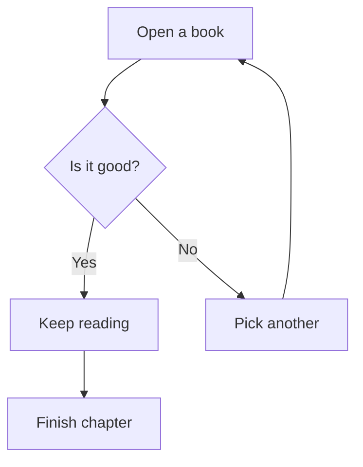
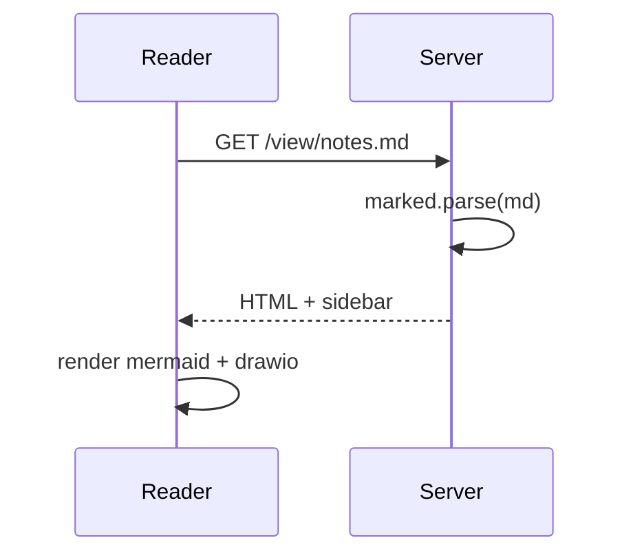

# Welcome

This is a sepia-toned markdown reader. Drop `.md` files into the `content/` directory and they'll appear in the tree on the left.

## Features

- **Sepia background** for easy reading
- **Collapsible folder tree** in the sidebar (state is remembered across pages)
- **Mermaid diagrams** via fenced ` ```mermaid ` blocks
- **Drawio diagrams** via fenced ` ```drawio ` blocks (paste raw drawio XML)
- GitHub-flavored markdown: tables, task lists, etc.

## Mermaid example



## Sequence diagram



## Tables

| Feature      | Status |
|--------------|--------|
| Markdown     | ✓      |
| Mermaid      | ✓      |
| Drawio       | ✓      |
| Folder tree  | ✓      |

> "A reader lives a thousand lives before he dies. The man who never reads lives only one."
> — George R.R. Martin
